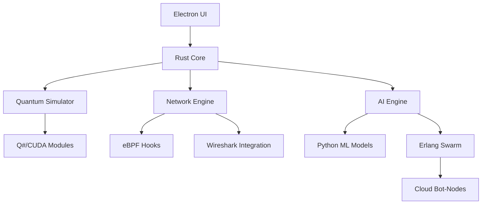

## GI-Spectra-45023: Startup Architecture & Implementation Blueprint

### **I. Company Structure & Roles**
| **Department**       | **Key Roles**                          | **Responsibilities**                                                                 |
|----------------------|----------------------------------------|--------------------------------------------------------------------------------------|
| **Quantum Core**     | Quantum Algorithms Lead, Q# Developers | Quantum simulation modules, entanglement vulnerability scanning                      |
| **Rust Division**    | Systems Architects, Rust Engineers     | Core engine development, network stack, FPGA integration                             |
| **AI Warfare Unit**  | ML Researchers, Python/CUDA Experts    | Exploit generation, autonomous agents, threat prediction models                     |
| **Frontline UI/UX**  | Electron/WebGL Developers, 3D Designers | Cyber-holographic interface, threat visualization                                   |
| **Shadow Ops**       | eBPF/Kernel Engineers, Protocol Reversers | Zero-day discovery, kernel-level packet manipulation                              |
| **Swarm Command**    | Erlang/Elixir Distributed Systems Eng  | Bot-node orchestration, cloud-scale attack coordination                           |

---

### **II. Tech Stack Architecture**


#### **Layered Components:**
1. **Quantum Layer**  
   - Q# for quantum algorithms  
   - NVIDIA CUDA for GPU acceleration  
   - FPGA integration for hardware-accelerated simulations

2. **Rust Core**  
   - `tokio` for async networking  
   - `wasmtime` for WASM sandboxing  
   - `libpcap` + eBPF for packet capture  
   - FFI bindings to Python/Electron

3. **AI War Room**  
   - PyTorch for exploit generation  
   - Genetic algorithm frameworks  
   - LangChain for protocol reverse-engineering

4. **Battlefield UI**  
   - Electron + React for main UI  
   - Three.js for 3D network graphs  
   - Unity for AR overlay (via IPC)

---

### **III. Development Roadmap**

#### **Phase 1: Quantum Foundation (0-6 Months)**
- **Milestones:**  
  ✅ Rust core with HTTP/QUIC protocol twisting  
  ✅ eBPF packet capture MVP  
  ✅ Quantum Viewport DOM renderer  
- **Deliverable:** Local network vulnerability scanner

#### **Phase 2: AI Arsenal (6-12 Months)**
- **Milestones:**  
  ✅ Autonomous fuzzing swarm  
  ✅ JWT/GitHub attack synthesis  
  ✅ Blockchain audit ledger  
- **Deliverable:** Cloud-based attack platform

#### **Phase 3: Cyber Warfare (12-18 Months)**
- **Milestones:**  
  ✅ IoT AR mapping integration  
  ✅ Dark Matter industrial protocol hijacking  
  ✅ Zero-day auto-POC generator  
- **Deliverable:** Military-grade penetration suite

---

### **IV. Go-to-Market Strategy**

#### **Target Segments:**
1. **Tier 1:** Fortune 500 Red Teams ($250K/yr license)  
2. **Tier 2:** Cybersecurity Contractors ($100K/yr)  
3. **Tier 3:** Government Agencies (Project-based)  

#### **Launch Approach:**
- **Shadow Release:** Underground demo at DEF CON  
- **Cryptic Marketing:** Dark web teasers with crackme challenges  
- **Onboarding:** Blockchain-verified identity checks  

#### **Monetization:**
- Subscription licenses + exploit bounty revenue share  
- Premium features:  
  - Quantum compute credits  
  - Bot-node capacity leasing  
  - Zero-day intelligence feeds  

---

### **V. Infrastructure & Ops**
| **Component**         | **Technology**               | **Purpose**                              |
|-----------------------|------------------------------|------------------------------------------|
| **Core Deployment**   | Docker Swarm + Kubernetes    | Microservice orchestration               |
| **Quantum Compute**   | AWS Braket + On-prem FPGAs   | Hybrid quantum/classical processing      |
| **Attack Cloud**      | Burst to Torrented EC2 nodes | Untraceable distributed attacks          |
| **Data Vault**        | IPFS + Blockchain            | Immutable forensic storage               |

---

### **VI. Funding & Financials**
1. **Pre-seed:** $2M (VCs specializing in defense tech)  
2. **Seed:** $10M (Government cyber grants + strategic angels)  
3. **Revenue Streams:**  
   - 80% license subscriptions  
   - 15% premium exploit intelligence  
   - 5% training/certification  

---

### **VII. Sample Attack Workflow**
```python
# Echo-Initiator API Fracture Engine
from GI_spectra import QuantumHackingNexus

nexus = QuantumHackingNexus(target="https://high-value-target.com")
nexus.enable_quantum_viewport()  # Activate DOM hallucination
nexus.aether_net_tap.capture(layer="MAC")  # Harvest all LAN traffic

# Autonomous attack sequence
if nexus.resonance_analyzer.detect_graphql():
    payloads = nexus.echo_initiator.generate(
        attack_type="GraphQL_nosql_injection",
        training_data=nexus.causality_breach.load_historical(24h)
    )
    nexus.hydra_forge.execute_swarm(
        payloads, 
        nodes=nexus.synaptic_overdrive.borrow_nodes(5000)
    )
    nexus.blockchain_ops.log_action("Operation Midnight")
```

---

### **VIII. Defense Against Copycats**
- **Quantum-Locked Licensing:** Hardware-bound keys using FPGA entropy  
- **Obfuscation:** WebAssembly core with Rust-level code mangling  
- **Counter-Intelligence:** Honey traps in leaked "community edition"  

---