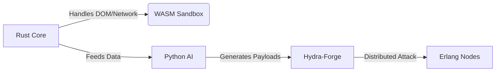

# GI-Spectra-45023

### **GI-Spectra-45023: The Quantum Hacking Nexus**  
**Core Concept:** GI-Spectra-45023 transcends traditional browsers—it’s a quantum-powered hacking nexus that manipulates digital reality at subatomic levels. Designed for elite ethical hackers, it merges multi-dimensional web interaction, AI-driven exploit synthesis, and quantum-grade forensics to dominate network ecosystems.  

---

### **I. Quantum Reality Forge: Virtual DOM & Temporal Manipulation**  
1. **Quantum Viewport (Virtual DOM Engine)**  
   - **Reality Distortion Filters:** Visually hallucinate hidden elements (e.g., render shadow-DOM as glowing fields).  
   - **Preemptive XSS/CSRF Sandbox:** Test payloads in a quantum-isolated DOM before execution.  
   - **AI-Powered Scraping:** Auto-adapt scrapers evolve with DOM mutations using ML.  
   - **★ New: Entanglement Scanner:** Detect side-channel vulnerabilities (e.g., timing attacks) via quantum behavior analysis.  

2. **Chronos-Shift (Time-Warp Forensics)**  
   - **What-If Scenario Engine:** Rewind sessions, inject historical payloads, and simulate cascading breaches.  
   - **Automated Regression Cortex:** AI compares session snapshots to flag behavioral anomalies.  
   - **★ New: Causality Breach:** Alter past network responses to test exploit chain reactions.  

---

### **II. Abyss-Snare: Quantum Network Dominance**  
3. **Deep-Packet Alchemy (Protocol Agnostic Interception)**  
   - **Chameleon Protocol Twisting:** Auto-switch protocols (e.g., HTTP/3 ↔ QUIC) mid-session.  
   - **Payload Crypt-Engine:** Integrate Frida hooks for real-time TLS decryption.  
   - **★ New: Dark Matter Injector:** Forge raw TCP/UDP packets to hijack non-HTTP protocols (e.g., industrial control systems).  

4. **Aether-Net Tap (Omniscient Network Capture)**  
   - **Promiscuous Cyber-Lens:** Capture LAN-wide traffic (MAC-layer) via kernel integration.  
   - **Wireshark Dissector Fusion:** Apply custom L7 dissectors for proprietary protocols.  
   - **★ New: Rogue AP Simulator:** Emulate malicious hotspots to study device behavior.  

5. **Echo-Initiator (AI-Driven Attack Synthesis)**  
   - **Contextual Payload Genesis:** AI crafts exploits using harvested app logic (e.g., JWT forging).  
   - **Autonomous Fuzzing Swarm:** Parallel fuzzers target parameters with genetic algorithms.  
   - **★ New: API Fracture Engine:** Auto-reverse engineer GraphQL/REST endpoints via traffic patterns.  

6. **Hydra-Forge (Adaptive Brute-Force)**  
   - **Cognitive Wordlist Synthesizer:** Generates dictionaries using target linguistics (e.g., scraped employee jargon).  
   - **Distributed Strike Module:** Coordinate 10k+ bot-nodes for cloud-scale credential stuffing.  
   - **★ New: Password Physics:** Calculate entropy in real-time to prioritize high-value targets.  

---

### **III. Mimic-Veil: Identity Warfare**  
7. **Persona-Shift (Dynamic Fingerprint Spoofing)**  
   - **Fingerprint Scrambler:** Rotate canvas/WebGL hashes hourly to evade detection.  
   - **★ New: Geospatial Ghosting:** Spoof GPS, timezones, and locale via browser API hooks.  

8. **Cloak-Weave (Origin Deception)**  
   - **Referer Chain Forger:** Simulate multi-step cross-domain journeys.  
   - **★ New: CORS Bypass Overdrive:** Exploit relaxed headers via preflight manipulation.  

---

### **IV. Nexus Control: Unified Cybernetic Interface**  
9. **Aether-Console (Quantum Execution Hub)**  
   - **Cross-Platform Script Injection:** Run Python/JS in DOM, network, or kernel space.  
   - **★ New: Zero-Day Arsenal:** Local exploit database (CVE) linked to auto-generated POCs.  

10. **Panopticon UI/CLI (Neuro-Synaptic Dashboard)**  
    - **Flow-State Visualization:** 3D graph of network topologies and attack paths.  
    - **CLI Data Streams:** Pipe real-time traffic to external tools (e.g., `grep | nmap`).  
    - **★ New: Holographic Threat Projection:** AR overlay for physical device mapping (IoT/OT).  

---

### **V. Quantum Resonance Engine (New)**  
11. **Resonance Analyzer**  
    - **AI Threat Modeling:** Predict 0-day vectors via reinforcement learning.  
    - **Autonomous Penetration Agent:** Self-directed bot performs recon → exploit → exfiltration cycles.  

12. **Synaptic Overdrive**  
    - **Collective Hive-Mind:** Sync multiple GI-Spectra instances for swarm hacking.  
    - **Blockchain OpSec:** Log actions to an immutable ledger for forensic auditing.  

---

### **Underlying Philosophy**  
GI-Spectra-45023 operates on **Quantum Hacking Principles**:  
- **Reality Manipulation:** Bend protocols, identities, and time itself.  
- **Autonomous Warfare:** AI agents execute multi-vector attacks with surgical precision.  
- **Omniscient Forensics:** Capture and replay the universe of network interactions.  

**Target:** Elite red teams, nation-state pentesters, and cyber warfare units.  
**Delivery:** Dockerized microservices with FPGA acceleration for quantum operations.  

---  
**GI-Spectra-45023 isn’t a tool—it’s the singularity where hacking transcends human limitations.**
---
---
### **Choosing best programming languages for the projects***
---
---
Recommended Architecture Overview:
 * Core Engine (Rust):
   * Network Interception (Deep-Packet Alchemy, Aether-Net Tap)
   * Low-level traffic manipulation
   * Brute-force engine (Hydra-Forge)
   * Potentially core session recording/playback logic (Chronos-Shift's data layer)
   * Provides C-compatible APIs for JavaScript/Node.js to interact with.
 * User Interface & Virtual Browser (JavaScript/HTML/CSS via Electron):
   * "Quantum Viewport" (browser rendering, virtual DOM manipulation)
   * "Panopticon UI" (all visual components, dashboards, interactive elements)
   * "Aether-Console" (JavaScript interpreter, direct DOM/network interaction)
   * Handles communication with the Rust core for performance-critical operations.
 * Scripting & Automation (Python, integrated via IPC/FFI):
   * Complex wordlist generation for Hydra-Forge.
   * Customizable attack sequences for Echo-Initiator.
   * External module integration.
This hybrid approach leverages the strengths of each language, allowing you to build a robust, high-performance, and highly interactive ethical hacking platform.

---

### **Specialized Add-ons**  
| **Component**               | **Language/Tool**       | **Purpose**                                                                 |
|----------------------------|-------------------------|-----------------------------------------------------------------------------|
| **Quantum Simulations**    | Q# / C++ (with CUDA)    | Model quantum behavior for `Entanglement Scanner`.                          |
| **Kernel Hooks**           | C (eBPF)                | Ultra-low-latency packet capture (`Promiscuous Cyber-Lens`).                |
| **Blockchain OpSec**       | Solidity + Go           | Immutable logging for `Synaptic Overdrive`.                                 |
| **AR Overlay**             | C# (Unity)              | `Holographic Threat Projection` for IoT mapping.                            |
| **Distributed Agents**     | Erlang/Elixir           | Orchestrate `Hydra-Forge` bot-nodes across cloud clusters.                  |

---

**Example Workflow:**  

